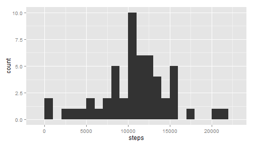
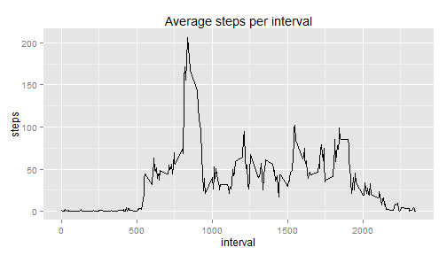
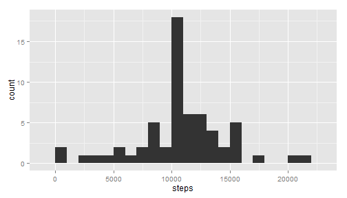

# Reproducible Research: Peer Assessment 1


## Loading and preprocessing the data

```r
## unzip data
unzip("./activity.zip")

## read csv
activity <- read.csv("activity.csv")
```


## What is mean total number of steps taken per day?

```r
## calculate the sum of steps for each day
totalStepsDay <- aggregate(steps ~ date, data = activity, sum)
```


Here is a histogram of the total number of steps per day

```r
## create histogram of summed steps
library(ggplot2)
qplot(steps, data = totalStepsDay, geom = "histogram", binwidth = 1000)
```

 


Here are the mean and median of the total steps per day

```r
mean(totalStepsDay$steps)
```

```
## [1] 10766
```

```r
median(totalStepsDay$steps)
```

```
## [1] 10765
```


## What is the average daily activity pattern?

```r
## calculate the average number of steps by interval period
aveStepsInterval <- aggregate(steps ~ interval, data = activity, mean)
```


```r
ggplot(aveStepsInterval, aes(x = interval, y = steps)) + geom_line() + ggtitle("Average steps per interval")
```

 


Here is the inteval with the max average number of steps

```r
## find the interval with the max average steps
aveStepsInterval[which.max(aveStepsInterval$steps), ]
```

```
##     interval steps
## 104      835 206.2
```


## Imputing missing values

```r
## calculate number of missing values in activity table
summary(activity)
```

```
##      steps               date          interval   
##  Min.   :  0.0   2012-10-01:  288   Min.   :   0  
##  1st Qu.:  0.0   2012-10-02:  288   1st Qu.: 589  
##  Median :  0.0   2012-10-03:  288   Median :1178  
##  Mean   : 37.4   2012-10-04:  288   Mean   :1178  
##  3rd Qu.: 12.0   2012-10-05:  288   3rd Qu.:1766  
##  Max.   :806.0   2012-10-06:  288   Max.   :2355  
##  NA's   :2304    (Other)   :15840
```

Looks like there are 2304 NAs in the steps column

```r
## duplicate activity table
activityImp <- activity
## replace NAs with interval averages calculated in prior section
for (i in 1:length(activityImp$steps)) {
    if (is.na(activityImp$steps[i])) 
        activityImp$steps[i] <- aveStepsInterval[which(aveStepsInterval$interval == 
            activityImp$interval[i]), 2] else next
}
```


```r
## calculate the sum of steps for each day in the completed data set
totalStepsDayImp <- aggregate(steps ~ date, data = activityImp, sum)
```

Here is a histogram of the total number of steps per day for the completed data

```r
## create histogram of summed steps
library(ggplot2)
qplot(steps, data = totalStepsDayImp, geom = "histogram", binwidth = 1000)
```

 


Here are the mean and median of the total steps per day for the completed data

```r
mean(totalStepsDayImp$steps)
```

```
## [1] 10766
```

```r
median(totalStepsDayImp$steps)
```

```
## [1] 10766
```

The imputed data did not make a significant difference in the mean and median between the original activity data and the data set completed with interval average data.  The means were effectively identical, and the median of the completed data was slightly higher.  By using interval data, the NA replacement doesn't skew the original data set, but it assumes the true values of the missing data points wouldn't have had a significant impact on the outcome of any analysis performed on the data.

## Are there differences in activity patterns between weekdays and weekends?


```r
## add in weekdays column
activityImp$weekend <- NA
for (i in 1:length(activityImp$date)) {
    if (weekdays(as.Date(activityImp$date[i])) %in% c("Saturday", "Sunday")) 
        activityImp$weekend[i] <- "weekend" else activityImp$weekend[i] <- "weekday"
}
## calculate the average number of steps by interval period and time of week
aveStepsIntervalImp <- aggregate(steps ~ interval + weekend, data = activityImp, 
    mean)
```


```r
p <- ggplot(aveStepsIntervalImp, aes(interval, steps)) + geom_line()
p + facet_grid(weekend ~ .)
```

 

